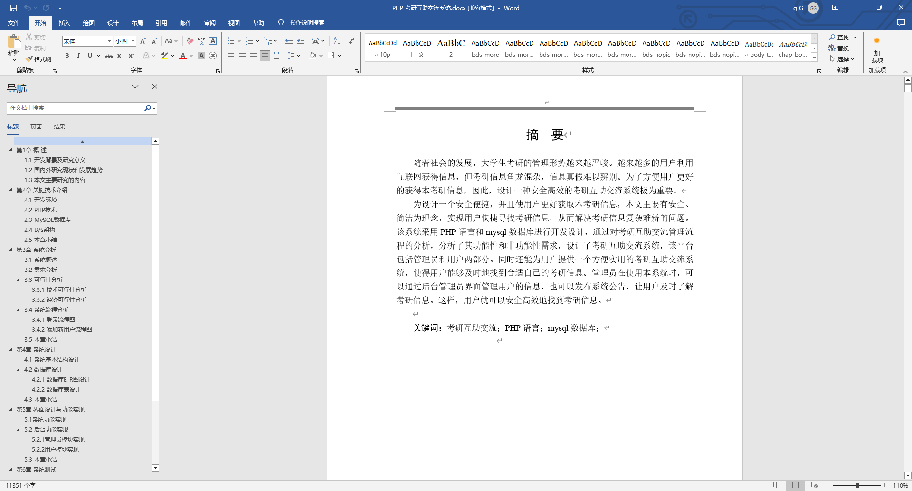
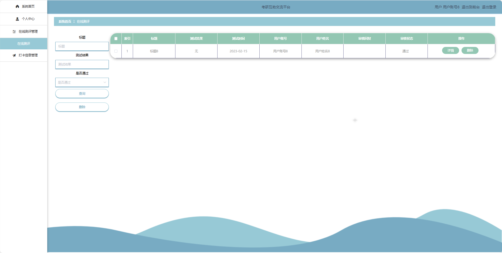
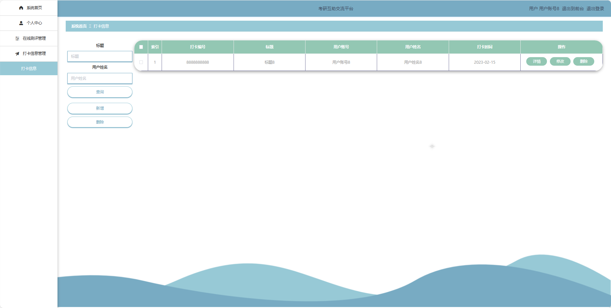
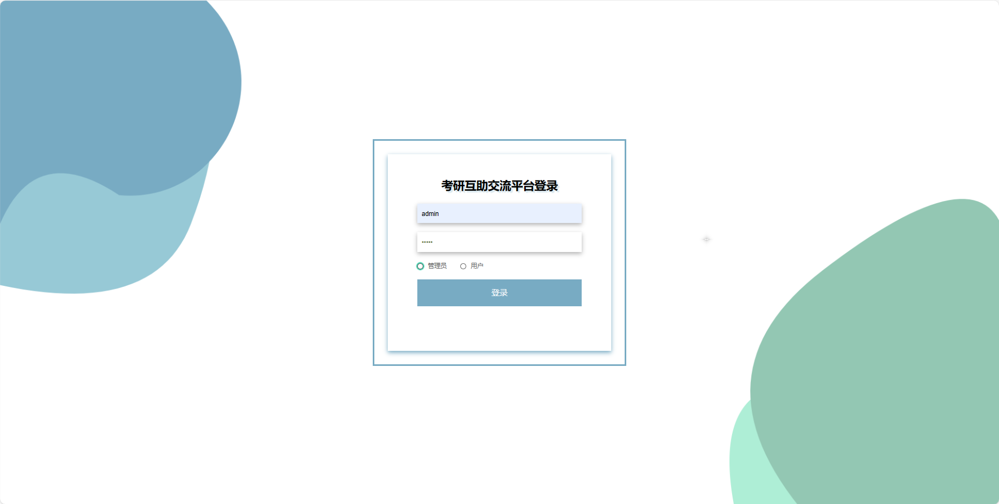
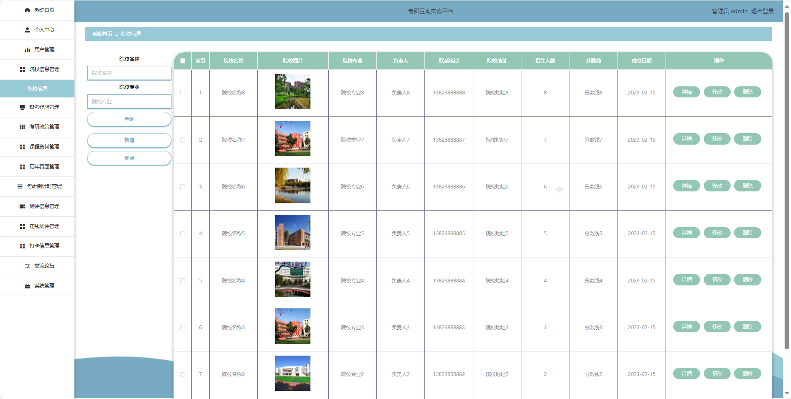

## 基于SpringBoot的考研互助交流平台(程序+报告)

###  获取sql数据库文件: 从戎源码网 (https://armycodes.com/) QQ: 386869957 QQ群: 377586148
###  所有系统地址: (https://github.com/YuLin-Coder/AllProjectCatalog) 
###  所有项目以及源代码本人均调试运行无问题 可支持远程安装部署调试、定制修改、代码讲解

## 项目介绍
基于SpringBoot的考研互助交流平台，系统包含两种角色：用户、管理员主要功能如下。

【用户功能】

1. **首页：** 提供平台的最新信息。
2. **院校信息：** 查看各个高校的招生信息。
3. **备考经验：** 浏览其他用户的备考经验。
4. **考研政策：** 提供最新的考研政策解读和变化。
5. **课程资料：** 提供相关课程的学习资料。
6. **历年真题：** 提供历年来的考研真题。
7. **考研倒计时：** 显示距离考研的倒计时。
8. **测评信息：** 提供在线测评功能。
9. **交流论坛：** 提供用户交流的平台
10. **复试调剂：** 提供关于复试调剂的相关信息和讨论区。

【用户后台管理】

1. **系统首页：** 显示系统整体概况和管理员的待办事项。
2. **个人中心：**
   - **修改密码：** 修改管理员账户的登录密码。
   - **个人信息：** 查看和编辑管理员的基本信息。
3. **在线测评管理：** 管理在线测评的相关信息。
4. **打卡信息管理：** 管理用户的学习打卡信息。
   
【管理员功能】

1. **系统首页：** 显示系统整体概。
2. **个人中心：**
   - **修改密码：** 修改管理员账户的登录密码。
   - **个人信息：** 查看和编辑管理员的基本信息。
3. **用户管理：** 管理平台注册用户的信息。
4. **院校信息管理：** 管理各个高校的招生信息。
5. **备考经验管理：** 管理备考经验的发布。
6. **考研政策管理：** 管理考研政策的发布。
7. **课程资料管理：** 维护相关课程的学习资料。
8. **历年真题管理：** 维护历年来的考研真题。
9. **考研倒计时管理：** 管理考研倒计时的设置和更新。
10. **测评信息管理：** 管理在线测评的相关信息。
11. **在线测评管理：** 管理用户的在线测评成绩和结果。
12. **打卡信息管理：** 管理用户的学习打卡信息。
13. **交流论坛：** 管理交流论坛的帖子。
14. **系统管理：**
    - **系统简介：** 提供关于系统的简要介绍。
    - **轮播图管理：** 管理系统首页的轮播图，包括新增、编辑和删除。
    - **复试调剂：** 管理复试调剂信息，提供相应的发布和管理功能。
    - **关于我们：** 提供关于平台的详细信息。

## 项目技术
- 编程语言：Java
- 数据库：MySQL
- 项目管理工具：Maven
- 前端技术：HTML、CSS、JavaScript、Jquery、Vue
- 后端技术：Spring、SpringMVC、MyBatis

## 运行环境
- JDK版本：JDK1.8及以上
- 开发工具：IDEA、Ecplise、Myecplise都可以
- 数据库: MySQL5.7及以上
- Maven：maven3.0及以上
- Node：14.14.0及以上

## 运行截图

